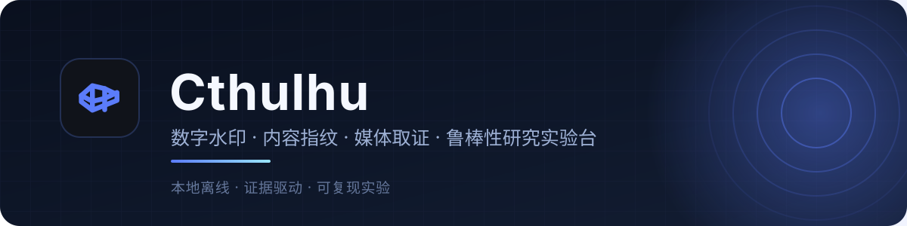
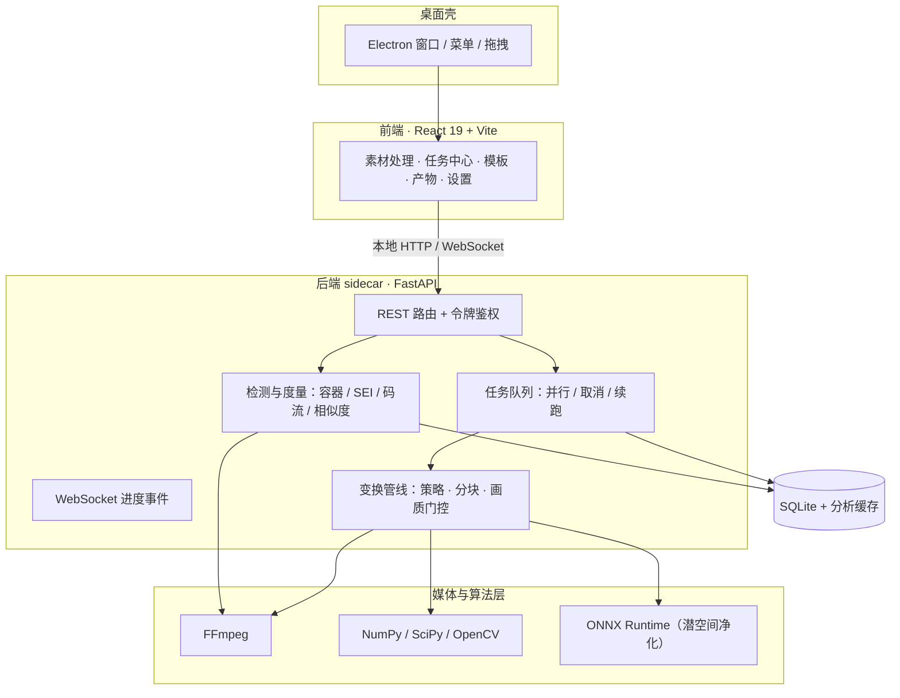

<p align="center">
  
</p>

<p align="center">
  <a href="docs/研究用途与合规声明.md"></a>
  
  
  
  
  
  
</p>

<p align="center">
  把「水印嵌入与参考检测 → 变换实验 → 相似度与画质度量 → 可复现记录」串成一条流水线<br>
  完全本地离线的桌面研究实验台 · 所有素材与结论都留在你自己的机器上
</p>

<p align="center">
  <picture>
    <source media="(prefers-color-scheme: dark)" srcset="docs/assets/screenshots/ui-workbench-dark.png">
    
  </picture>
  <br>
  <sub>素材处理工作台：素材库 · 预览与逐帧检查 · 分组变换参数 · 产物面板（深色主题跟随系统）</sub>
</p>

> **研究用途声明**
>
> 本项目及仓库内全部文档仅供研究、教学和授权测试使用。严禁用于去除版权或
> 溯源水印、规避平台审核与风控、侵权搬运、账号矩阵规避、欺诈或其他违法违规
> 用途。完整边界见
> [docs/研究用途与合规声明.md](docs/研究用途与合规声明.md)，该声明优先于仓库内
> 任何历史方向稿与实验记录。

## 目录

- [这是什么](#这是什么)
- [能力地图](#能力地图)
- [界面一览](#界面一览)
- [技术栈与架构](#技术栈与架构)
- [快速开始](#快速开始)
- [研究 CLI 与实验 API](#研究-cli-与实验-api)
- [目录结构](#目录结构)
- [打包与出包](#打包与出包)
- [提交前校验](#提交前校验)
- [文档导航](#文档导航)
- [许可与使用边界](#许可与使用边界)

## 这是什么

Cthulhu 是一个面向**数字水印、内容指纹、媒体取证与视频变换鲁棒性**的本地离线
实验台。它把研究者日常需要的四件事接成一条可审计的流水线：把素材导入本地库、
用可参数化的变换原语做实验、用参考水印与代理指标量化结果、把参数与产物留档以便
复现。

它不是一个黑箱工具，也不承诺任何平台效果：

- **观感与可复现性并重**：每一步变换都如实报告画质代价（PSNR / SSIM / VMAF），
  产物自带参数快照，同一份快照可以跨构建复现。
- **证据驱动**：结论必须过本地代理回归门；「基准库内有效」不等于「真实平台有效」。
- **离线私有**：素材不出本机，不依赖云服务、账号登录或按次计费。

适用于合成样本、自有素材或已获明确授权的素材与测试账号上的研究、教学与授权测试。

## 能力地图

| 模块 | 现在能做什么 |
| :--- | :--- |
| **素材处理工作台** | 拖拽 / 目录批量导入，封面与元信息（分辨率、帧率、时长），重复内容识别，逐帧预览与「原片 / 处理后」对比滑杆 |
| **变换实验** | 按分组组合变换原语（画面重建、嵌入域重写、几何与时序去同步、色彩微扰、音频处理、重编码与信号扰动、画质优化、输出编码），档位标注耗时与画质代价 |
| **参考检测与度量** | 容器 / 元数据 / SEI 扫描、码流层 QP 图 · 码量分配 · GOP 分析，内容 / 运动 / 哈希 / 画质相似度，BER / PSNR / SSIM / VMAF（对齐后） |
| **任务中心** | 批量入队、并行调度、进度与取消、进程重启后续跑、任务历史与产物跳转 |
| **去重模板** | 内置多档实验预设，一键回填参数；模板可新建、编辑、复制、删除 |
| **产物管理** | 产物清单与占用统计、来源素材追溯、参数快照查看、对比与清理 |
| **研究 CLI** | 合成样本生成、水印鲁棒性压力测试矩阵、样本制备与差分、判重代理基准、性能基准与预设校准 |
| **桌面集成** | Electron 壳、FFmpeg 自动探测与内置、潜空间净化运行时随包就绪、一键出 dmg |

## 界面一览

<p align="center">
  
  <br>
  <sub>原片 / 处理后对比：同一时间轴上的滑块对照，用于人工核查观感代价</sub>
</p>

<p align="center">
  
  <br>
  <sub>任务中心：排队 / 处理中 / 已完成 / 失败统计，任务历史含耗时、输出路径与管线</sub>
</p>

<p align="center">
  
  <br>
  <sub>去重模板：内置预设把参数组合固化为可复用对象，卡片直接展示各分组启用项数</sub>
</p>

五个视图的完整说明（含产物管理、设置与截图复现步骤）见
[docs/界面导览.md](docs/界面导览.md)。所有截图均使用合成的演示素材，不含真实素材
或第三方内容。

## 技术栈与架构

- **前端**：React 19 + TypeScript + Vite + Tailwind CSS 4 + Zustand + shadcn/ui
- **桌面壳**：Electron（窗口、菜单、拖拽、生命周期、IPC）
- **后端**：Python 3.12 + FastAPI（sidecar 进程，REST + WebSocket 进度事件）
- **媒体 / 算法**：FFmpeg、OpenCV、NumPy / SciPy / PyWavelets、ONNX Runtime
  （潜空间净化走 TAESD 权重，随包内置）
- **存储**：SQLite（素材库、模板、任务历史、产物参数快照） + 本地分析缓存



开发模式下 Vite（5173）代理 `/api` 与 `/ws` 到 uvicorn（57173）；打包后由
FastAPI 同时托管前端静态资源，Electron 窗口加载本地地址。

## 快速开始

### 环境要求

- Node.js 22+、pnpm 11+
- uv（Python 3.12，由 uv 自动管理）
- FFmpeg（系统安装；打包版优先使用内置静态构建）

> 网络较慢时，Electron 二进制可走镜像安装：
> `ELECTRON_MIRROR=https://npmmirror.com/mirrors/electron/ pnpm --dir electron rebuild electron`

### 安装与运行

```bash
pnpm install                # 根依赖（concurrently）
pnpm --dir ui install       # 前端依赖
pnpm --dir electron install # Electron 运行时
cd backend && uv sync --extra purify   # 后端依赖（含潜空间净化运行时）
cd ..                       # 回到仓库根目录

pnpm dev                    # 开发模式：Vite + Python 后端，浏览器打开 http://localhost:5173
pnpm dev:desktop            # 桌面模式：额外拉起 Electron（主进程自动拉起后端）
```

开发阶段默认用 `pnpm dev` + 浏览器即可，轻量快速；需要验证桌面壳时才用
`pnpm dev:desktop`。

> 想在不影响日常素材库的前提下试用，可以用独立的数据目录启动：
> `CTHULHU_DB=/tmp/cthulhu-demo/cthulhu.db pnpm dev`（详见
> [界面导览 · 复现与更新截图](docs/界面导览.md#复现与更新截图)）。

### 潜空间净化能力（开箱即用）

净化运行时（torch / diffusers / transformers 等）随开发环境与桌面端一起安装，
用户不需要手工装 Python 包。TAESD 权重（`madebyollin/taesd`，约 10MB）随安装包
内置，安装后零下载、首次开启即可推理。引擎是「潜空间瓶颈重建」：公开深度水印
写在低频，重建由解码器先验主导，清除率与原先的 sd-turbo 扩散方案持平或更好，
速度快约 50 倍（research §19）。开发环境可先执行一次 `pnpm package:model` 生成
`packaging/models`（或从已有权重目录复制），之后 `pnpm dev` 会自动使用内置目录。

```bash
# 查看运行时 / 模型 / 设备状态
uv run --project backend --extra purify cthulhu purify-status
# 仅开发 / 自托管环境需要：没有内置权重时的下载兜底
uv run --project backend --extra purify cthulhu purify-install
```

可配置项：

- `CTHULHU_PURIFY_MODEL_DIR=<dir>`：自定义权重目录（覆盖内置目录）；
- `CTHULHU_PURIFY_ALLOW_DOWNLOAD=0`：禁用兜底下载（离线 / 内网部署）；
- `CTHULHU_PURIFY_TAESD_MODEL=<repo-id>`：替换默认权重 `madebyollin/taesd`；
- `HF_ENDPOINT=https://hf-mirror.com`：国内镜像。

API：`GET /api/purify/status` 查询状态与进度，`POST /api/purify/install`
触发后台下载（内置权重已就绪时是空操作）。

### 白盒定向（仅研究侧）

白盒 EOT-PGD / mask PGD 只保留在 `research/`：
`research/scripts/targeted_worker.py`、`research/scripts/eot_core.py` 与
`research/vendor` 的公开权重。正式 App 不再内置白盒 worker、权重或入口；原因是
白盒只支持已公开方案、600 帧短片上限，5 分钟视频即使分段也要数小时。正式产品
统一走黑盒净化 + 嵌入域重写。

## 研究 CLI 与实验 API

M2 起，研究闭环优先走命令行，评估策略为「自建参考水印基准库 + 授权环境下的
合规性观察」。以下命令仅用于合成样本、自有素材或已授权素材：

> 说明：CLI 中 `desensitize`、`cleanse` 等历史命名仅表示研究性变换实验，
> 不代表允许用于规避平台规则、去除版权 / 溯源水印或侵权搬运。

```bash
cd backend && uv sync          # 同步研究依赖（numpy / scipy / typer / pytest / ruff）

uv run cthulhu gen             # 生成合成干净样本（视频帧 npy + 音频 wav）
uv run cthulhu harness-video   # 水印(Lsb/SS/QIM) × 鲁棒性压力测试矩阵 → BER/PSNR/SSIM
uv run cthulhu harness-audio   # 回声隐藏水印 × 音频鲁棒性压力测试矩阵
uv run cthulhu probe 素材.mp4                # 容器 / 元数据 / SEI 探测
uv run cthulhu sample-diff clean.mp4 wm.mp4  # 对齐 + 差分报告 + DCT 热图
uv run cthulhu bitstream 素材.mp4 [--reference clean.mp4]  # 码流层 QP / 码量 / GOP 分析
uv run cthulhu desensitize in.mp4 out.mp4 [--speed 0.95] [--recrop 0.03]
uv run cthulhu similarity a.mp4 b.mp4         # 内容 / 运动 / 哈希 / 画质相似度

uv run pytest                  # 基准库往返与鲁棒性压力测试
uv run ruff check src tests    # 静态检查
```

研究实验 API（`pnpm dev` 时运行在 `127.0.0.1:57173`，带任务进度 WebSocket；
除 `/api/health` 外都需要令牌，见 [backend/README.md](backend/README.md)）：

```text
POST /api/detect        {"path": "..."}   → 容器 / SEI / 压缩域联合检测报告
POST /api/similarity    {"a": "...", "b": "..."} → 内容 / 运动 / 哈希相似度
POST /api/desensitize   {"path": "...", "output": "...", ...} → 研究性变换 + 前后相似度 + VMAF
```

当前实现：LSB / 空域扩频 / DCT-QIM / 回声隐藏等参考嵌入器，去噪 / 重量化 /
几何 / 时序 / 协同平均 / 音频变速等鲁棒性压力测试，BER / PSNR / SSIM / VMAF
（对齐后）指标，真实视频解码 / 编码、相位相关对齐与差分样本制备，压缩域
（码流层）QP 图 / 码量分配 / GOP / SEI 分析（支持与干净基准的差分判定），以及
内容变换实验（分镜重排 / 变速 / 重新构图 / 重调光 + 自建内容 / 运动 embedding 与
dHash 相似度量化）。

## 目录结构

```text
docs/                    规划、实施、发布、研究笔记与合规声明（索引见 docs/README.md）
docs/assets/             README 与文档使用的横幅、截图
ui/                      React 前端（素材处理 / 任务中心 / 模板 / 产物 / 设置）
electron/                Electron 主进程、preload 与 sidecar 监督
backend/                 Python 后端（FastAPI + 变换管线 + 研究 CLI）
research/                研究实验脚本、公开方案报告与权重（仅研究侧）
packaging/               PyInstaller spec、electron-builder 配置、内置 ffmpeg 获取
data/                    样本与实验数据（不入库）
```

## 打包与出包

```bash
pnpm package                 # 前端构建 → PyInstaller 后端 → electron-builder dmg
```

产物：`packaging/dist/Cthulhu-<版本>-arm64.dmg`（版本号唯一真值在
`backend/src/cthulhu_backend/version.py`，其余清单由
`backend/scripts/sync_version.py` 同步）。当前为未签名研究实验构建；签名 / 公证
与 Windows 打包仅作为工程化验证项，不代表允许对外商业化分发。打包版依赖系统
安装的 ffmpeg / ffprobe（检测、变换实验、修复、VMAF 均需要），也可由
`packaging/fetch_ffmpeg.sh` 获取静态构建并内置。

## 提交前校验

云端 workflow 已于 2026-09-14 全部移除（当时失败的四条原因与复现条件见
[docs/发布打包.md](docs/发布打包.md) 第 6 节）：`Check` 与本地提交前跑的命令完全
一致，打包用本机 `pnpm package` 更快也更可控。提交前按下面这套跑一遍即可：

```bash
pnpm typecheck && pnpm test                     # UI 类型 + vitest + electron
cd backend && uv run ruff check src tests && uv run pytest tests -q
uv run python scripts/export_openapi.py         # 契约漂移：openapi.json / api-types.ts
```

测试与实验报告输出到 `backend/data/`（已忽略入库）。

## 文档导航

| 文档 | 内容 |
| :--- | :--- |
| [docs/README.md](docs/README.md) | 文档总索引：分类、阅读顺序与文档约定 |
| [研究用途与合规声明](docs/研究用途与合规声明.md) | **最高优先级**：允许 / 禁止范围、数据边界、结果解释边界 |
| [界面导览](docs/界面导览.md) | 五个视图的界面说明与截图复现步骤 |
| [产品定位与架构](docs/产品定位与架构.md) | 研究定位、设计哲学与扩展缝隙 |
| [实施文档](docs/实施文档.md) | 技术选型、分层架构、数据模型、里程碑与验收标准 |
| [发布打包](docs/发布打包.md) | 打包清单、签名 / 公证、打包后冒烟与 CI 变更记录 |
| [backend/README.md](backend/README.md) | 后端模块地图、CLI、接口契约与常用环境变量 |
| [research/README.md](research/README.md) | 研究实验台主记录：公开方案鲁棒性报告与脚本入口 |

## 许可与使用边界

- 本仓库**未附开源许可证**，默认保留全部权利；如需在许可范围外使用代码或文档，
  请先与维护者确认授权。
- 允许范围以 [研究用途与合规声明](docs/研究用途与合规声明.md) 为准：仅限学术研究、
  课程教学、个人学习与算法原理验证，且素材须为合成样本、自有素材或已获明确授权
  的素材，平台侧观察须在平台明确授权的测试账号 / 接口 / 沙箱内进行。
- 本项目不提供任何「保证过审」「保证不限流」「保证不被识别」的能力或承诺，
  本地指标与代理分数都不代表平台真实判定。
