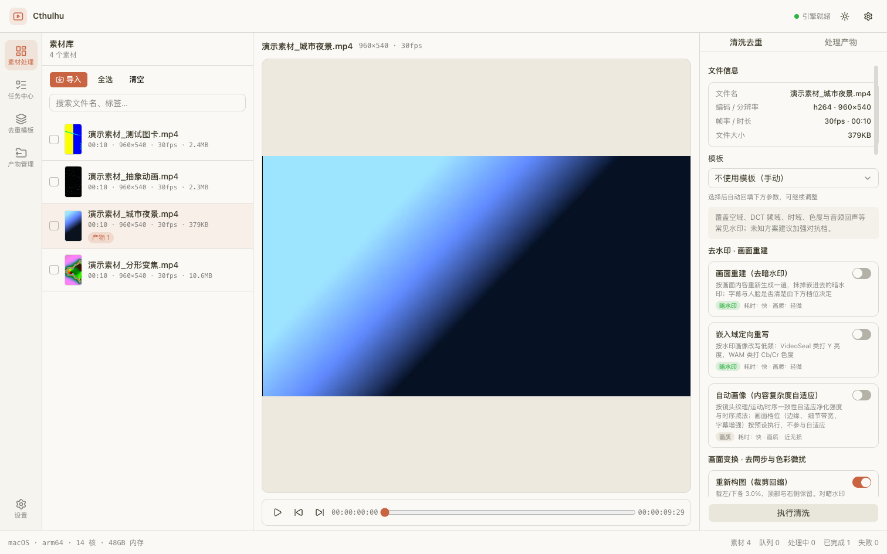
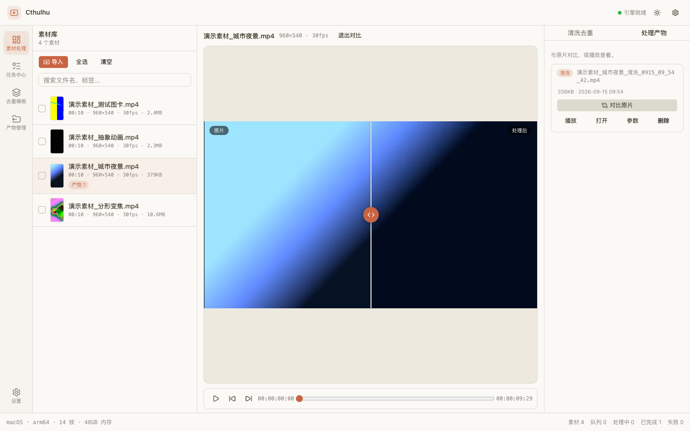
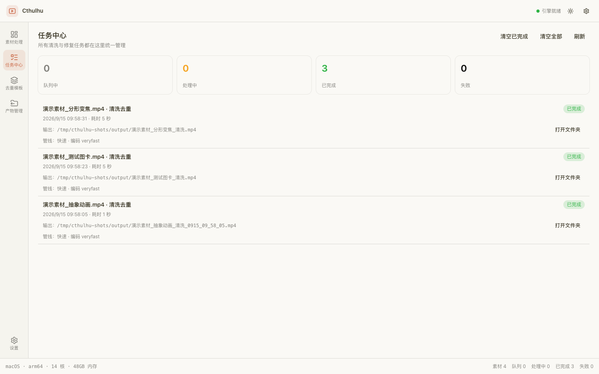
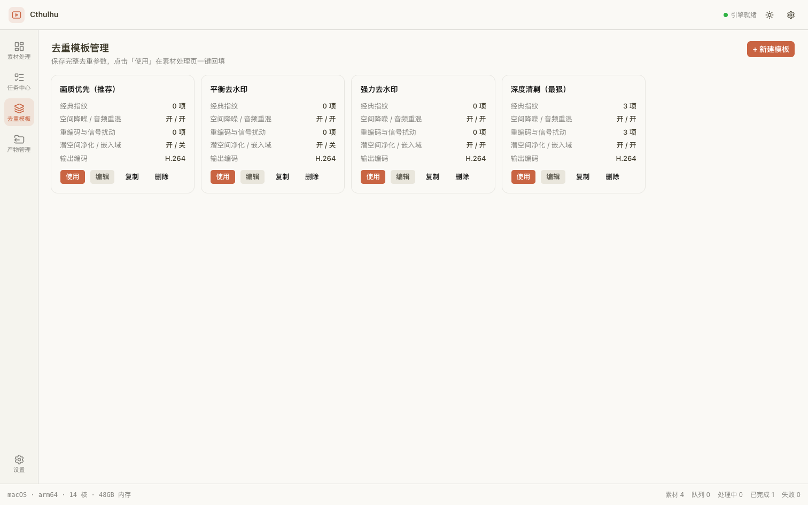
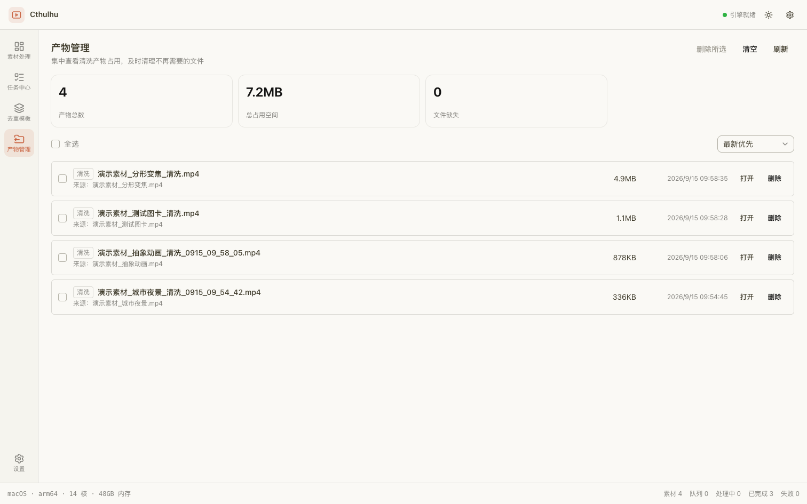
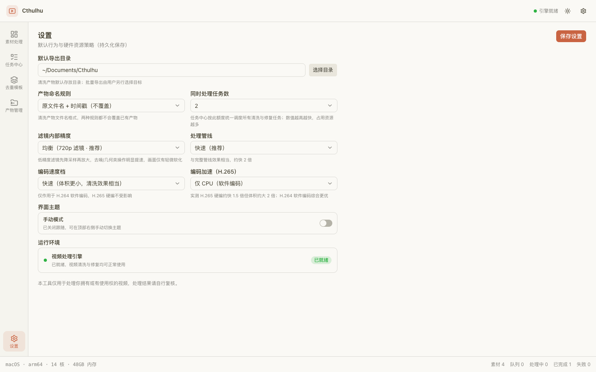

# Cthulhu 界面导览

> 文档导航：[README](../README.md) · [文档索引](README.md) · [研究用途与合规声明](研究用途与合规声明.md) · [产品定位与架构](产品定位与架构.md) · [实施文档](实施文档.md) · [发布打包](发布打包.md)

> **研究用途声明**：本文仅用于数字水印、内容指纹、媒体取证与视频变换的研究、
> 教学和授权测试。严禁用于规避平台规则、去除版权/溯源水印、侵权搬运、账号
> 矩阵规避或其他违法违规用途。完整边界见
> [研究用途与合规声明](研究用途与合规声明.md)。

本文按视图逐一说明实验台的界面构成与交互入口，用于快速建立整体印象。所有截图
取自本地开发实例，素材为按下面的[复现步骤](#复现与更新截图)生成的合成演示视频，
不含任何真实素材或第三方内容。

## 1. 素材处理工作台

<p align="center">
  <picture>
    <source media="(prefers-color-scheme: dark)" srcset="assets/screenshots/ui-workbench-dark.png">
    
  </picture>
  <br>
  <sub>素材处理工作台：素材库 · 预览 · 参数面板（上图为浅色主题，深色主题自动跟随系统或手动切换）</sub>
</p>

| 区域 | 内容与入口 |
| :--- | :--- |
| 左侧 · 素材库 | 拖拽或按目录导入视频，显示封面、时长、分辨率、帧率与文件大小；支持搜索、全选、清空；已有产物的素材带「产物 N」角标 |
| 中间 · 预览区 | 播放 / 暂停、逐帧前进与后退、进度拖动；进入对比模式后可用滑块对照「原片 / 处理后」 |
| 右侧 · 清洗去重 | 文件信息、模板回填、按分组的变换开关（去水印·画面重建 / 画面变换 / 音频处理 / 重编码与信号扰动 / 画质优化 / 输出编码）与「执行清洗」 |
| 右侧 · 处理产物 | 当前素材的产物列表，支持对比原片、播放、打开所在目录、查看参数快照与删除 |
| 顶部与底部 | 引擎就绪状态、主题切换、设置入口；底部状态栏显示系统信息与素材 / 队列计数 |

### 产物对比

<p align="center">
  
  <br>
  <sub>对比原片：同一时间轴上的「原片 / 处理后」滑块对照，用于人工核查观感代价</sub>
</p>

## 2. 任务中心

<p align="center">
  
  <br>
  <sub>任务中心：排队 / 处理中 / 已完成 / 失败统计，任务历史含耗时、输出路径与所用管线</sub>
</p>

- 批量任务统一入队，按设置的并行度调度，支持排队、取消与历史清理；
- 每条任务记录素材名、创建时间、耗时、输出路径与管线档位，可直接打开产物所在目录；
- 进程重启后按记录自动续跑未完成任务，避免整批实验因中断作废。

## 3. 去重模板

<p align="center">
  
  <br>
  <sub>去重模板：内置四档预设（画质优先 / 平衡 / 强力 / 深度），可新建、编辑、复制与删除</sub>
</p>

模板把一次实验用到的参数组合固化为可复用对象，卡片上直接展示经典指纹、空间降噪
与音频重混、重编码与信号扰动、潜空间净化与嵌入域、输出编码等分组下的启用项数，
便于在复用前快速核对强度与代价。

## 4. 产物管理

<p align="center">
  
  <br>
  <sub>产物管理：集中查看产物数量、占用空间、来源素材与生成时间，并支持批量清理</sub>
</p>

产物按时间倒序排列，可直接打开或删除；「文件缺失」计数用于提示被外部移动或删除
的产物，避免实验记录与磁盘内容不一致。

## 5. 设置

<p align="center">
  
  <br>
  <sub>设置：默认导出目录、产物命名规则、并行任务数、滤镜精度、处理管线与编码档位</sub>
</p>

设置项覆盖默认导出目录与命名规则、并行任务数、滤镜内部精度、处理管线、编码速度与
编码加速、界面主题，并在「运行环境」中给出视频处理引擎的就绪状态。

## 复现与更新截图

截图使用隔离的数据目录启动，避免把演示素材写进日常素材库：

```bash
# 合成演示素材（无第三方内容，仅用于界面展示）
mkdir -p /tmp/cthulhu-demo/library
ffmpeg -y -f lavfi -i "gradients=s=960x540:c0=0x0b1220:c1=0x5b7cfa:c2=0x9ae6ff:n=3:speed=0.06:d=10:r=30" \
  -f lavfi -i "sine=f=330:d=10" -c:v libx264 -crf 20 -c:a aac -shortest \
  /tmp/cthulhu-demo/library/演示素材_城市夜景.mp4

# 隔离数据库与缓存目录启动开发实例
CTHULHU_DB=/tmp/cthulhu-demo/cthulhu.db \
CTHULHU_THUMB_CACHE=/tmp/cthulhu-demo/thumbs \
CTHULHU_CACHE_DIR=/tmp/cthulhu-demo/analysis_cache \
pnpm dev
```

截图约定：视口 1512×945（CSS 像素），素材处理视图同时保留浅色与深色两版，其余视图
使用浅色主题；文件命名 `ui-<视图>.png`，存放于 `docs/assets/screenshots/`。

更新截图时请确认画面中不含真实素材、真实文件路径与个人目录信息。
